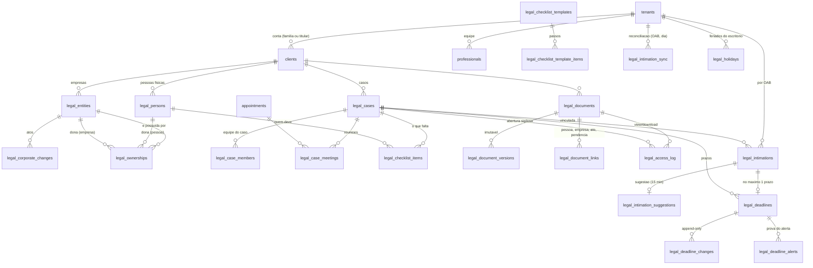

# 101 · Anexo 01 · Modelo de dados do pacote Advocacia

> Convenções herdadas do `CLAUDE.md`: tabelas e colunas em inglês; `tenant_id` em toda tabela de
> dado de tenant; `enable` + `force row level security` na mesma migration; dinheiro em centavos;
> `timestamptz` UTC; nunca `delete` de histórico. Rótulos: **[FATO]**, **[HIPÓTESE]**, **[DECISÃO PENDENTE]**.
> Origem no LUBI indicada por migration e linha; a reescrita troca `account_id` por `client_id`,
> `staff_users` por `professionals`/`auth.users` e acrescenta `tenant_id`.

## 1. Diagrama

Tabelas sem `tenant_id` (dado de plataforma, como `modules` e `professions`): `legal_holidays` com
`tenant_id` **nulo** (feriado nacional/estadual carregado pelo CICLO) convive com linhas com
`tenant_id` (feriado forense da comarca cadastrado pelo escritório). Mesmo desenho para
`legal_checklist_templates` (modelo da plataforma × modelo do escritório).

## 2. Dicionário

Em toda tabela: `id uuid pk default gen_random_uuid()`, `created_at`, `updated_at` (gatilho), `created_by uuid default auth.uid()`
quando faz sentido; `row_version int` nas que a tela edita (conflito de edição). "Escreve" e "Lê" apontam a tela ou função.

### 2.1 `legal_persons` (pessoas físicas da conta)

Origem: LUBI `people` (0007, NÃO LI o corpo) e `matter_parties` (`0013:69-83`).

| Coluna | Tipo | Regra | Escreve | Lê |
|---|---|---|---|---|
| tenant_id | uuid not null → tenants | RLS | cadastro | tudo |
| client_id | uuid not null → clients | `unique (id, client_id)` para FK composta | cadastro | Cliente 360, Estrutura |
| full_name | text not null, 2..160 | | cadastro | tudo |
| relationship | text check in (titular, conjuge, filho_filha, pai_mae, irmao_irma, neto_neta, socio_socia, outro) | rótulo neutro na tela | cadastro | Estrutura |
| marital_regime | text check in (comunhao_parcial, comunhao_universal, separacao_total, participacao_final, uniao_estavel, nao_informado) | | cadastro | Estrutura, simulador |
| birth_date | date | | cadastro | ficha |
| document_hash | text check `~ '^[0-9a-f]{64}$'` | sha256(CPF + sal do servidor), **nunca o CPF** (D2) | servidor | dedupe, conflito (P2) |
| phone_e164 | text | opcional; a conta (`clients.phone_e164`) é o contato padrão | cadastro | mensagem pronta |
| email | citext | | cadastro | ficha |
| is_contact | boolean default false | quem recebe cobrança de documento quando a pendência não aponta pessoa | cadastro | mensagem pronta |
| notes | text ≤ 2000 | **não** para dado de saúde (mesma regra de `clients.notes`, `0001:231`) | ficha | ficha |
| archived_at | timestamptz | arquivar, nunca apagar | ficha | listas |

Índices: `(tenant_id, client_id) where archived_at is null`; `(tenant_id, document_hash) where document_hash is not null`.
Política: `for all using (has_tenant(tenant_id)) with check (has_tenant(tenant_id))` (padrão de `tenant_modules`, `0025:31-33`).
Retenção: junto do cliente (eliminação LGPD anonimiza nome, telefone, e-mail, hash).

### 2.2 `legal_entities` (empresas)

Origem: `0014:53-82`. Mesmas colunas e checks, com `cnpj` **omitido** (só `cnpj_hash`, D2).

| Coluna | Tipo | Regra |
|---|---|---|
| tenant_id, client_id | uuid not null | FK composta `(client_id, tenant_id)` |
| kind | text check in (holding_patrimonial, holding_participacoes, holding_mista, operacional, outra) | `0014:56` |
| legal_name | text not null 2..200 | |
| trade_name | text ≤ 120 | |
| cnpj_hash | text `^[0-9a-f]{64}$` | `unique (client_id, cnpj_hash) where not null` (`0014:81`); em clientes diferentes é permitido e vira sinal de conflito (P2) |
| legal_form | text check in (ltda, slu, sa_fechada, sa_aberta, eireli_legado, simples_sociedade, cooperativa, outra) | `0014:61` |
| tax_regime | text check in (simples, presumido, real, imune_isenta, nao_informado) | |
| main_cnae | text `^\d{7}$` | |
| city, uf | text | `uf ~ '^[A-Z]{2}$'` |
| incorporated_on | date 1900..hoje | |
| share_capital_cents | bigint ≥ 0 | centavos |
| total_quotas | bigint > 0 | |
| status | text check in (ativa, inativa, baixada, em_constituicao) default ativa | |
| is_external | boolean default false | empresa de fora da família que aparece no quadro |
| next_review_on | date | **ponto de extensão** "ativo com ciclo": revisão anual da holding (sem leitor no MVP além da ficha; escritor = ficha) |
| archived_at | timestamptz | |

Gatilhos: `touch_row`, auditoria, `negar_delete` (`0014:165-168`). Política: `has_tenant`.

### 2.3 `legal_corporate_changes` (atos)

Origem: `0014:87-104`. `tenant_id`, `client_id`, `entity_id`, `effective_on date`, `kind` check in (constituicao,
alteracao_contratual, cessao_quotas, aumento_capital, reducao_capital, doacao_quotas, entrada_socio, saida_socio,
transformacao, incorporacao, outro), `description ≤ 1000`, `registered_on date`. Append-only (sem UPDATE/DELETE).
Escreve: RPC `legal_apply_corporate_change(p jsonb)` **INVOKER** (PM-D-009). Lê: Estrutura, linha do tempo.

### 2.4 `legal_ownerships` (participação temporal)

Origem: `0014:109-160`, literal, com `tenant_id` e `client_id`.

- `owned_entity_id`, `owner_person_id` ou `owner_entity_id` (exatamente um), `percent numeric(9,6)` em (0, 100],
  `quotas bigint`, `quota_class`, `usufruct_person_id`, `usufruct_until`, `valid_from date not null`, `valid_to date`,
  `opened_by_change_id not null`, `closed_by_change_id`, `owner_key` gerada.
- Checks: dono único; empresa não é dona de si; `valid_to > valid_from`; `(valid_to is null) = (closed_by_change_id is null)`.
- `exclude using gist (owned_entity_id with =, owner_key with =, daterange(valid_from, valid_to, '[)') with &&)` (`0014:147-153`).
- **Nunca UPDATE de percentual**: fechar e abrir pela RPC (gatilho `ownership_so_fecha`, `0014:192`).
- Escreve: a RPC. Lê: `effectiveOwnership` em `src/core/advocacia/participacao.ts` (cópia de `ownership.ts`).

### 2.5 `legal_cases`

Origem: `0013:11-43` + `0028:17-21`.

| Coluna | Tipo | Regra | Escreve | Lê |
|---|---|---|---|---|
| tenant_id, client_id | uuid not null | | "Novo caso" | tudo |
| kind | text check in (holding, inventario, planejamento_sucessorio, divorcio_partilha, contrato, societario, tributario, trabalhista, civel, outro) | define o modelo de checklist | "Novo caso" | fila, listas |
| title | text 2..200 | interno | "Novo caso" | equipe |
| client_title | text 2..200 not null | o que o cliente lê (mensagem pronta usa só isto) | "Novo caso" | mensagem pronta |
| status | text check in (aberto, em_andamento, aguardando_cliente, aguardando_terceiros, concluido, arquivado) default aberto | | ficha | fila, listas |
| client_status_note | text ≤ 300 | frase que o cliente vê na mensagem de andamento | diálogo "mudar estado" | mensagem pronta |
| sensitivity | text check in (normal, sigiloso) default normal | sigiloso só membros + owner; rebaixar só owner com `sensitivity_reason` | ficha | RLS |
| sensitivity_reason | text ≤ 300 | | ficha | auditoria |
| responsible_professional_id | uuid → professionals | | ficha | fila (dono) |
| cnj_number | text `^[0-9]{20}$` | só dígitos; vínculo automático da intimação | ficha | captura |
| rito | text check in (civel, trabalhista, jec, penal) | marcação manual (PM-D-022) | ficha | cálculo de prazo |
| prazo_em_dobro | boolean default false | manual, nunca inferido | ficha | cálculo |
| comarca | text 2..80 | feriados municipais | ficha | cálculo |
| opened_on | date not null default dia no fuso do tenant | | | |
| closed_on | date ≥ opened_on | | ficha | |
| archived_at | timestamptz | | ficha | |
| checklist_template_version | int | versão do modelo congelada ao criar | "Novo caso" | ficha |

Política de leitura: `has_tenant(tenant_id) and legal_can_access_case(id)`. `legal_can_access_case(case_id)`: `security definer`,
`search_path` fixo, devolve `true` para `owner`/`manager`; para sigiloso, só membro em `legal_case_members`; para normal, qualquer
papel ativo (reescrita de `0013:90`). `insert`: `has_tenant` e papel em (owner, manager, professional, reception). `update`:
quem lê e papel ≠ finance; rebaixar `sensitivity` só owner (gatilho). Nunca DELETE (gatilho + sem política).

### 2.6 `legal_case_members`

`tenant_id`, `case_id`, `professional_id`, `role` check in (responsavel, equipe). PK `(case_id, professional_id)`. Gatilho
`sigiloso_tem_membro` (`0013:226`): caso sigiloso não fica sem membro. Política: leitura por quem acessa o caso; escrita owner/manager
e o responsável.

### 2.7 `legal_case_meetings`

`tenant_id`, `case_id`, `appointment_id` (→ appointments), PK `(case_id, appointment_id)`. Tabela de vínculo em vez de coluna em
`appointments`: não toca tabela do núcleo e evita a segunda FK para a mesma tabela que quebra o embed do PostgREST (memória
`segunda-fk-quebra-embed-postgrest`). Escreve: "+ Reunião" na ficha do caso. Lê: fila (fonte `meeting`), ficha.

### 2.8 `legal_checklist_templates` e `legal_checklist_template_items`

Novo (LUBI planejou em `11` §4 como `workflow_templates`, sem implementar).

- `legal_checklist_templates`: `tenant_id` **nulo** = modelo da plataforma; `case_kind` (mesma lista de `legal_cases.kind`),
  `name`, `version int not null default 1`, `active boolean`. `unique (coalesce(tenant_id, '00000000-...'), case_kind, version)`.
- `legal_checklist_template_items`: `template_id`, `position`, `title`, `instructions ≤ 2000`, `kind` check in
  (enviar_documento, assinar, responder, conferir, agendar), `owed_by` check in (cliente, equipe), `expected_category`
  (lista de `legal_documents.category`), `offset_business_days int` (prazo relativo à abertura do caso), `urgency`.
- Política: leitura `authenticated` para `tenant_id is null`, `has_tenant` para o resto; escrita só `has_tenant` em linha
  própria; modelo da plataforma só por migration/seed.
- Mudar o modelo **não** mexe em caso aberto (versão congelada em `legal_cases.checklist_template_version`).
- Modelos iniciais do seed (texto `precisa_revisao` do advogado): Holding patrimonial, Inventário extrajudicial,
  Planejamento sucessório, Divórcio consensual com partilha, Contrato societário. Itens de exemplo para holding: contrato
  social atual, cartão CNPJ, matrícula de cada imóvel, IPTU/ITR/CCIR, declaração de IR dos sócios, certidões civis, pacto
  antenupcial, comprovante de endereço. **[DECISÃO PENDENTE: o advogado revisa a lista]**.

### 2.9 `legal_checklist_items` ("o que falta de você")

Origem: `0021:85-123`.

| Coluna | Tipo | Regra | Escreve | Lê |
|---|---|---|---|---|
| tenant_id, client_id, case_id | uuid not null | | gerar do modelo; "+ Pedido" | fila, Cliente 360 |
| template_item_id | uuid | de onde veio (nulo se manual) | gerar | |
| title | text 2..200 | | | |
| instructions | text ≤ 2000 | orientação interna ao cliente, sem dado sensível; **não** vai na mensagem de WhatsApp (a mensagem pronta usa só `title` e `client_title`, D6) | ficha | ficha |
| kind | text check (enviar_documento, assinar, responder, conferir, agendar) | | | |
| owed_by | text check (cliente, equipe) | | | fila (`owner_kind`) |
| owed_by_person_id | uuid → legal_persons | quando `owed_by = cliente` e há pessoa certa | | mensagem pronta (telefone) |
| expected_category | text | categoria de documento esperada | | conferência |
| urgency | text check (alta, media, baixa) default media | | | prioridade |
| due_on | date | prazo combinado | | fila |
| status | text check (rascunho, pendente, recebido, em_conferencia, concluido, devolvido, cancelado) default pendente | `rascunho` quando criado por `legal_role = 'estagio'`; aprova quem é advocacia | botões | fila |
| returned_reason, cancel_reason | text | obrigatórios nos estados correspondentes (checks `0021:113-116`) | botões | |
| rodada | int ≥ 1 default 1 | devolução abre rodada nova | gatilho | idempotência de lembrete |
| reminders_sent, last_reminder_at, next_reminder_on | int, timestamptz, date | escada D0/D+3/D+7, D+10 vira tarefa "ligar" | job diário `legal.lembretes` | fila |
| document_id | uuid → legal_documents | o que chegou | conferência | ficha |
| approved_by, approved_at | uuid, timestamptz | aprovação do rascunho | botão | |
| position | int | ordem na tela | arrastar | ficha |

Índice parcial `(tenant_id, due_on) where status in (pendente, recebido, em_conferencia, devolvido)`. Política: leitura por
quem acessa o caso; escrita papel ≠ finance. `concluido` só quem é advocacia ou direção **[HIPÓTESE]**.

### 2.10 `legal_documents`, `legal_document_versions`, `legal_document_links`

Origem: `0023:60-157`. Mudanças: sem `visibility` (sem portal no MVP: tudo interno); `sensitivity` herda do caso quando há caso
(check `documents_sigiloso_tem_caso`, `0023:94`); `origin` em (equipe, cliente_por_link) com `cliente_por_link` **reservado**
(link de envio sem login é P2).

- `legal_documents`: `tenant_id`, `client_id`, `case_id?`, `title`, `category` (lista de `0023:65-70`), `tags text[] ≤ 20`,
  `current_version_id`, `issued_on`, `valid_until` (≥ issued_on), `sensitivity`, `origin`, `status` check (recebido,
  em_conferencia, aceito, recusado) default `aceito` para origem equipe e `recebido` para cliente, `refused_reason`,
  `reviewed_by`, `reviewed_at`, `archived_at`.
- `legal_document_versions`: `document_id`, `tenant_id`, `version_no`, `storage_path` (bucket `legal-docs`, `{tenant}/{client}/{doc}/{v}`),
  `mime` (lista fechada `0023:115-119`), `size_bytes` ≤ 52.428.800, `sha256`, `validated boolean`, `uploaded_by`, `note ≤ 300`.
  `unique (document_id, version_no)`, `unique (storage_path)`. Imutável (gatilho `so_valida`, `0023:415`).
- `legal_document_links`: `document_id`, `tenant_id`, `target_type` check (person, entity, corporate_change, checklist_item),
  `target_id`, `unique (document_id, target_type, target_id)`. O caso **não** entra aqui (uma fonte de sigilo: `documents.case_id`).
- Bucket: privado; política de `storage.objects` que só permite leitura via RPC (mesmo desenho de `0023:567`); escrita só pela rota
  após validação.

### 2.11 `legal_access_log`

Origem: `0023:161-177`. `id bigint identity`, `at`, `tenant_id`, `user_id`, `client_id`, `document_id?`, `version_id?`, `case_id?`,
`kind` check (view, download, open_case), `ip_hash`. Check: `(document_id is not null) <> (case_id is not null and kind = 'open_case')`.
**Sem política** (só `service_role` grava, via RPC `legal_abrir_documento`/`legal_abrir_caso_sigiloso`; só `owner` lê por rota que
usa `withTenant`). Entra em `NEGADAS_POR_DESIGN` do `isolation.test.ts:30`. Retenção 5 anos.

### 2.12 `legal_intimations`

Origem: `0026:37-77`. `tenant_id not null` (a captura é por tenant × OAB), `djen_id bigint`, `unique (tenant_id, djen_id)`
(a mesma comunicação pode chegar a dois escritórios com advogados diferentes), `hash`, `numero_processo ^[0-9]{20}$`,
`data_disponibilizacao date`, `tribunal`, `orgao`, `tipo`, `classe`, `texto_sanitizado ≤ 200000`, `link https`, `destinatarios jsonb`,
`alvo` (chave `oab:12345/SC`), `case_id?`, `status` check (nova, vinculada, prazo_criado, sem_prazo, descartada) default nova,
`triaged_by`, `triaged_at`, `reason`, `cancelled_at`, `cancel_reason`. Checks de coerência de estado (`0026:64-72`).
Gatilhos: `touch`, auditoria, `negar_delete`, `negar_truncate`, "só estado muda" (`0026:112`).
Política de leitura: `has_tenant` e (caso nulo → papel em (owner, manager, professional); caso → `legal_can_access_case`).
**Privilégio por coluna**: `texto_sanitizado` e `destinatarios` fora do `grant select` de `authenticated` (padrão `0077:56-73`);
quem precisa do texto lê pela RPC `legal_abrir_intimacao(id)`, que grava `legal_access_log` **[HIPÓTESE: justificada pelo texto
conter nome de partes]**. Escrita: só a RPC `legal_intimacoes_gravar(p jsonb)` (service_role, subtransação por item,
`0026:168`) e a RPC de decisão.

### 2.13 `legal_intimation_sync`

`tenant_id`, `alvo`, `dia`, `count_fonte`, `count_gravado`, `ok`, `detalhe`. `unique (tenant_id, alvo, dia)`. Sem política (servidor).
Lê: health. Nunca apaga.

### 2.14 `legal_intimation_suggestions`

Origem: `0028:109-118`. `tenant_id`, `intimation_id`, `suggested_due_on`, `internal_due_on`, `calc_memo jsonb < 8000 bytes`,
`calc_rule_version`, `sem_sugestao text`, `created_at`. Só `service_role` escreve (`legal_intimacao_registrar_sugestao`); a decisão
lê a sugestão de até 15 min atrás e **nunca** aceita a data do chamador como "sugerida" (achado 1 da revisão do T11.3, `0028:5-7`).
Sem política.

### 2.15 `legal_deadlines`

Origem: `0020:121-153` + `0028:54-73`.

| Coluna | Tipo | Regra |
|---|---|---|
| tenant_id, client_id, case_id? | uuid | prazo contratual pode não ter caso |
| kind | text check (fatal, interno, audiencia, contratual) | |
| title | text 2..200 | interno |
| due_on | date 2000..2100 | |
| due_at | timestamptz | só audiência (check `0020:148`) |
| source | text check (manual, djen, modelo) default manual | |
| intimation_id | uuid → legal_intimations | `unique where not null` (uma intimação, um prazo, `0028:73`) |
| internal_due_on | date ≤ due_on | fatal − N dias úteis (N em `settings.advocacia.internal_days`, padrão 2) |
| suggested_due_on, calc_memo, calc_rule_version, calc_divergence, calc_sem_sugestao | | prova do cálculo; só nasce pela porta da decisão e não muda (`0028:75-80`) |
| responsible_professional_id | uuid | default responsável do caso |
| alert_days | int[] | dias úteis; `@> '{1,0}'` |
| confirmed_by, confirmed_at | | fatal criado por `legal_role = 'estagio'` nasce sem confirmação |
| close_note, close_document_id | | "Cumpri" fatal exige um dos dois |
| status | text check (aberto, cumprido, perdido, cancelado) | perdido/cancelado exigem `close_reason` |
| closed_at, closed_by, close_reason, change_reason | | `change_reason` transitório → `legal_deadline_changes` |

Regras por gatilho (`0020:216,297`): fatal/audiência não adia nem dispensa; mudar `due_on`, `kind`, `responsible` de fatal exige
motivo e grava histórico; rebaixar de fatal só advocacia/direção; prazo nascido em caso com `cnj_number` nasce fatal. Nunca DELETE.
Política: leitura por quem acessa o caso (ou `has_tenant` quando sem caso); escrita papel ≠ finance; `reception` não cria fatal.

### 2.16 `legal_deadline_changes`, `legal_deadline_alerts`

`0020:164-190`, com `tenant_id`. Append-only, **sem política** (servidor/gatilho). `legal_deadline_alerts` `unique (deadline_id, marco)`.

### 2.17 `legal_holidays`

`0020:74-80` + `0028:24-26`: `id`, `tenant_id` (nulo = plataforma), `day date`, `scope` check (nacional, estadual, municipal,
recesso, forense), `name`, `tribunal?`, `comarca?`, `fonte_url?`, `conferido_por?` (PM-D-025). `unique (coalesce(tenant_id, zero),
day, coalesce(tribunal,''), coalesce(comarca,''))`. Seed: nacionais 2026-2027 e recesso (`0020:87-116`); TJSC 2026 da portaria
(`11` §8.2) com `fonte_url`. Política: leitura `authenticated` para plataforma + `has_tenant`; escrita `has_tenant` e `owner`.

### 2.18 Colunas em tabelas existentes (aditivas)

- `professions.pacote text not null default 'base' check (pacote in ('base', 'advocacia'))`.
- `professionals.oab_number text`, `professionals.oab_uf text check ~ '^[A-Z]{2}$'`, `professionals.legal_role text check in
  ('advogado', 'estagio')` (nulos fora do pacote).
- `tenants.is_demo boolean not null default false` (alvo de `demonstracao.ts:11-16`).
- `terms_acceptances.documento` check amplia para `('termos', 'privacidade', 'adendo_advocacia')` (aditivo; `0095:38`).
- `tenants.settings.advocacia` (jsonb, sem migration): `{ prazo_regras_confirmadas: text[], internal_days: 2, djen_names: [],
  mfa_obrigatoria: true }`, validado por Zod na rota.
- `message_templates`: linhas semeadas pelo pacote (`slug` com prefixo `advocacia_`), sem placeholder de assunto/bem/processo.

## 3. Políticas, seed de isolamento e exceções (resumo operacional)

| Tabela | RLS | Política | Linha em `isolation.test.ts` `restantes` | Lista de exceção |
|---|---|---|---|---|
| legal_persons, legal_entities, legal_corporate_changes, legal_ownerships | E+F | `has_tenant` (ownerships: escrita só via RPC INVOKER) | sim | |
| legal_cases, legal_case_members, legal_case_meetings | E+F | `has_tenant` + `legal_can_access_case` | sim | |
| legal_checklist_templates(_items) | E+F | `tenant_id is null → authenticated select`; `has_tenant` | sim (linha com tenant) | |
| legal_checklist_items | E+F | acesso ao caso | sim | |
| legal_documents, _versions, _links | E+F | acesso ao caso ou `has_tenant`; versões sem UPDATE/DELETE | sim | |
| legal_access_log | E+F | **nenhuma** | sim | `NEGADAS_POR_DESIGN` |
| legal_intimations | E+F | leitura por papel/caso; escrita só RPC | sim | |
| legal_intimation_sync, legal_intimation_suggestions | E+F | **nenhuma** | sim | `NEGADAS_POR_DESIGN` |
| legal_deadlines | E+F | acesso ao caso | sim | |
| legal_deadline_changes, legal_deadline_alerts | E+F | **nenhuma** | sim | `NEGADAS_POR_DESIGN` |
| legal_holidays | E+F | plataforma `authenticated`; tenant `has_tenant` | sim | |

A conferência das listas "nem infladas nem defasadas" (`isolation.test.ts:515-533`) obriga a atualizar as duas listas no
mesmo commit da migration.

## 4. Escritor e leitor de cada coluna nova que não é óbvia

| Coluna | Escritor | Leitor | Se faltar escritor |
|---|---|---|---|
| `legal_entities.next_review_on` | ficha da empresa (campo opcional) | ficha; futura fonte de "ativo com ciclo" | fica nula, sem efeito; **não** entra na fila no MVP (sem motor para ela) |
| `legal_cases.client_status_note` | diálogo de mudança de estado ("quer avisar o cliente? frase que verá") | mensagem pronta de andamento | mensagem de andamento usa só `client_title` |
| `legal_cases.checklist_template_version` | "Novo caso" | ficha ("modelo v2") | |
| `legal_checklist_items.next_reminder_on` | criação (D0) e job `legal.lembretes` | fila | job sem rodar → item fica sem lembrete, health acusa (`next_reminder_on < hoje − 2`) |
| `legal_deadlines.internal_due_on` | gatilho ao inserir/alterar `due_on` com N do tenant | fila ("fazer até") | |
| `legal_deadlines.calc_*` | só RPC de decisão | ficha do prazo; métrica de divergência | |
| `professionals.oab_*` | tela Equipe | captura; aviso "N sem OAB" | aviso permanente em Configurações |
| `tenants.is_demo` | script de seed e migration `0111` (backfill pela lista) | sitemap, robots, mensageria, aviso, guarda de conversão | lista de slugs continua valendo na transição |

Colunas que estavam no LUBI e **saem** por não terem escritor no MVP: `matters.client_next_step` (portal fora),
`documents.visibility` (sem portal), `documents.opened_by_member_id` (sem membro de portal), `client_actions.assigned_member_id`
(vira `owed_by_person_id`).

## 5. Ordem das migrations

Todas aditivas. A regra "restritiva depois do deploy" só pesa quando o código antigo depende do estado anterior; as tabelas
`legal_*` nascem sem código antigo, então nascem já fechadas (sem política de DELETE, grants mínimos).

| # | Arquivo | Conteúdo | Conferência local | Reversão |
|---|---|---|---|---|
| 0101 | `0101_pacote_advocacia.sql` | `professions.pacote`; linha `advocacia`; backfill `pacote = 'base'` | `select count(*) from professions where pacote='advocacia'` = 1; beleza inalterada | drop column; delete linha |
| 0102 | `0102_modulos_do_pacote.sql` | 5 módulos `legal_*` em `modules` (`0041:35-51`) | `modulos-catalogo.test.ts` bate com `CATALOGO` | delete linhas |
| 0103 | `0103_legal_pessoas_e_estrutura.sql` | `legal_persons`, `legal_entities`, `legal_corporate_changes`, `legal_ownerships`, RPC INVOKER, gatilhos | isolamento; paridade TS × SQL da participação efetiva | drop |
| 0104 | `0104_legal_casos.sql` | `legal_cases`, `legal_case_members`, `legal_case_meetings`, `legal_can_access_case` | sigiloso: não membro lê 0 | drop |
| 0105 | `0105_legal_checklists.sql` | modelos + itens + `legal_checklist_items`; seed dos 5 modelos (`precisa_revisao`) | criar caso gera N itens | drop |
| 0106 | `0106_legal_documentos.sql` | documentos, versões, vínculos, `legal_access_log`, bucket `legal-docs`, RPC `legal_abrir_documento` | versão imutável; acesso registrado | drop; remover bucket |
| 0107 | `0107_legal_intimacoes.sql` | `professionals.oab_*/legal_role`, `legal_intimations`, `legal_intimation_sync`, RPC gravar, privilégio por coluna | controle +/− do stub; coluna de texto negada ao `authenticated` | drop |
| 0108 | `0108_legal_prazos.sql` | `legal_holidays` (seed), `legal_deadlines`, `_changes`, `_alerts`, `_suggestions`, RPCs de sugestão e decisão, gatilhos de blindagem, prazo interno | blindagem; gabarito em modo "sem arquivo" | drop |
| 0109 | `0109_legal_mensagens_e_aceite.sql` | seed de `message_templates` do pacote; `terms_acceptances.documento` += `adendo_advocacia` | guarda `whatsapp-sem-dado-sigiloso` | delete; voltar check |
| 0110 | `0110_pg_cron_legal_intimacoes.sql` | job `ciclo_legal_intimacoes` (irmã da `0087`), lê `cron_base_url`/`cron_secret` do Vault | `status_do_cron_do_motor()` lista o job | `cron.unschedule` |
| 0111 | `0111_tenants_is_demo.sql` | coluna + backfill pela lista de slugs | `is_demo` dos 13 slugs = true | drop |
| 0112 | `0112_legal_grants_minimos.sql` | `revoke delete` explícito nas `legal_*` com histórico; `grant` só do que a rota usa | `sem-delete-em-tabela-append-only` | regrant |

Cada migration: `MIGRATIONS_ESPERADAS`/`ULTIMA_MIGRATION` (`versao.ts:23-26`) no mesmo commit; `pnpm db:types`; linha no seed do
isolamento; teste de RLS visto reprovando ao comentar a política (mutação, anexo 05 §4).

Como o Eduardo aplica: `supabase db push` no projeto certo, após conferir `scripts/conferir-schema-prod.mjs` (existe, `01-reaproveitamento`
#9) e com `ADVOCACIA_ABERTA` desligada; o `/api/health` acusa schema atrás (`health.ts:2,48`).

## 6. Retenção e eliminação (LGPD)

| Entidade | Prazo | Ao vencer / ao pedir eliminação |
|---|---|---|
| pessoas, empresas, casos, checklist, documentos de cliente ativo | enquanto cliente | arquivar |
| cliente encerrado | **[DECISÃO PENDENTE: prazo; o LUBI deixou Q3 aberta]**; nada apaga sozinho | anonimizar identificadores; documentos removidos do bucket; metadados ficam anonimizados |
| `legal_intimations` | 5 anos | nunca apaga (fato público do tribunal); anonimizar vínculo ao cliente na eliminação |
| `legal_access_log`, `legal_deadline_changes`, `legal_deadline_alerts` | 5 anos | apagar por job `lgpd-retention` (rota existe, `src/app/api/cron/lgpd-retention`) |
| `legal_intimation_suggestions` | 30 dias | apagar (job) |
| `job_queue` payload de captura | 7 dias após `done` | faxina já existente (NÃO LI); o payload leva só tenant, OAB e dia |

Eliminação a pedido do titular: estende `POST v1/clients/[id]/erase` (`pausa.ts:53`) para anonimizar `legal_persons` e desvincular
documentos; tabelas append-only são **anonimizadas**, nunca apagadas (regra do LUBI `07` §5). Portabilidade: `GET
v1/clients/[id]/data-export` (existe) passa a incluir o jurídico **só do titular** (sem cônjuge e herdeiros).
