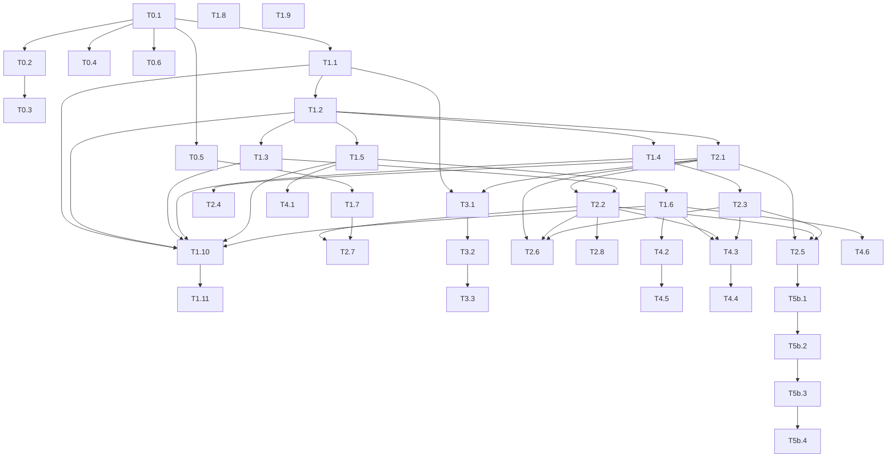

# 101 · Anexo 03 · Backlog de tickets

> Um ticket, um commit. Mensagem em português via arquivo (`git commit -F`), `git add` por nome,
> `pnpm verify` completo antes (em segundo plano). Cada ticket cita a peça de origem, o critério de
> aceite verificável, os testes exigidos, o risco, as dependências e **a guarda nova com a mutação
> que a faz reprovar**. Pastas: `src/core/advocacia/` (puro), `src/server/advocacia/` (banco),
> `src/app/admin/(advocacia)/` ou rotas existentes condicionadas ao pacote, `src/app/api/v1/legal/*`.

## 1. Rotas de escrita novas e a classificação na pausa (`core/billing/pausa.ts:26`)

| Rota | Regra | Por quê |
|---|---|---|
| `POST v1/legal/persons` | bloqueia | cria linha nova |
| `PATCH v1/legal/persons/[id]` | permite | edita o que existe |
| `POST v1/legal/entities` | bloqueia | |
| `PATCH v1/legal/entities/[id]` | permite | |
| `POST v1/legal/entities/[id]/changes` | bloqueia | ato societário novo |
| `POST v1/legal/cases` | bloqueia | |
| `PATCH v1/legal/cases/[id]` | permite | inclui estado e sigilo |
| `POST v1/legal/cases/[id]/members` | permite | configuração de acesso |
| `DELETE v1/legal/cases/[id]/members/[professionalId]` | permite | |
| `POST v1/legal/cases/[id]/meetings` | bloqueia | cria agendamento |
| `POST v1/legal/cases/[id]/checklist` | bloqueia | item novo |
| `PATCH v1/legal/checklist/[id]` | permite | estado, prazo, devolução |
| `POST v1/legal/checklist/[id]/approve` | permite | rascunho → pendente |
| `POST v1/legal/documents` | bloqueia | |
| `POST v1/legal/documents/[id]/versions` | bloqueia | versão nova |
| `PATCH v1/legal/documents/[id]` | permite | conferência |
| `POST v1/legal/documents/[id]/open` | permite | leitura com trilha (cria linha de trilha, mas é obrigação, não criação de negócio) |
| `POST v1/legal/intimations/[id]/decide` | permite | triagem é obrigação |
| `POST v1/legal/intimations/capturar` | permite | captura manual sob demanda (rate limit) |
| `POST v1/legal/deadlines` | bloqueia | |
| `PATCH v1/legal/deadlines/[id]` | permite | com motivo |
| `POST v1/legal/deadlines/[id]/close` | permite | cumprir/perder/cancelar |
| `PATCH v1/tenant/advocacia` | permite | regras confirmadas, N interno, MFA, nomes |
| `PATCH v1/professionals/[id]` (OAB) | permite | já existe |
| `POST api/cron/legal-intimacoes` | fora | cron |
| `POST v1/legal/accept` (adendo) | permite | obrigação da conta (já previsto para o #144) |

## 2. Tickets por fase

Formato: **ID · título** · objetivo · arquivos · migration · aceite · testes · risco · depende de · guarda e mutação.

### Fase 0 · Alicerce (produto de beleza intocado)

**T0.1 · Profissão Advocacia e o registro de pacotes**
- Objetivo: a linha `advocacia` no catálogo, a coluna `professions.pacote`, `src/core/pacotes/{index,base,advocacia}.ts`,
  `DadosDoTenant.pacote`.
- Arquivos: `supabase/migrations/0101_pacote_advocacia.sql`; `src/core/pacotes/*`; `src/server/auth/tenant.ts:18-44,80,104-117`;
  `src/core/schema/versao.ts:23-26`; `src/server/db/types.gen.ts` (`pnpm db:types`).
- Aceite: tenant de beleza resolve `pacote = 'base'`; tenant com profissão `advocacia` resolve `'advocacia'`; `professions` sem
  linha → `'base'`.
- Testes: unitário `pacotes.test.ts` (registro completo; `base` = `ABAS` e `HREF_DO_CENTRO` atuais por snapshot); integração
  `catalogo-profissoes.test.ts` (existe) ganha o caso `advocacia`.
- Risco: baixo (coluna com default).
- Depende de: nada.
- Guarda: `pacote-tem-registro` lê o `check` da `0101` e exige igualdade com `Object.keys(PACOTES)`. Mutação: remover `advocacia` do
  registro → reprova; trocar o default da coluna para `'advocacia'` → snapshot de beleza reprova.

**T0.2 · Quarta camada de módulo: pacote**
- Objetivo: módulos `legal_cases`, `legal_checklists`, `legal_structure`, `legal_deadlines`, `legal_documents`; `CONDICAO_DE_PACOTE`;
  `Veredito` `fora_do_pacote`; `exigirModulo` cobre.
- Arquivos: `0102_modulos_do_pacote.sql`; `src/core/billing/planos.ts:39-57,72-92,135-152,297-395`; `src/server/services/planos.ts:96-133,257-278`;
  `src/app/admin/config/modulos/modulos.tsx` (ramo novo: módulo fora do pacote não aparece).
- Aceite: para um tenant `base`, o veredito de **todos** os módulos é idêntico ao de antes (snapshot gravado antes da mudança);
  `legal_*` → `fora_do_pacote`; para `advocacia`, `legal_*` → `liberado` no `essencial`.
- Testes: unitário `podeUsarModulo` (tabela de casos); `modulos-catalogo.test.ts` (duas listas batem); integração `exigirModulo`
  em tenant base → `FORBIDDEN`.
- Risco: médio (toca todo tenant).
- Depende de: T0.1.
- Guarda: snapshot `vereditos-de-beleza-nao-mudam`. Mutação: inverter a ordem (plano antes de pacote) → snapshot reprova.

**T0.3 · Menu e centro pelo pacote**
- Objetivo: `TabBar` recebe `abas`/`hrefFab` do pacote; rotas `/admin/casos`, `/admin/pendencias` com `page.tsx` placeholder,
  `loading.tsx` e estado vazio com saída.
- Arquivos: `src/components/shell/tab-bar.tsx:33-36`; `src/app/admin/layout.tsx:87-176` (passa `ctx.tenant.pacote`);
  `src/app/admin/(advocacia)/casos/*`, `pendencias/*`.
- Aceite: beleza vê a barra de hoje (snapshot DOM); advocacia vê Hoje · Casos · Pendências · Agenda · Clientes; alvos ≥ 48 px.
- Testes: guardas `telas-do-admin-tem-loading`, `estado-vazio-tem-saida`, `alvo-de-toque-tem-48`, `titulos-de-tela` cobrem
  as rotas novas; unitário `hrefDaAbaAtiva` com as abas do pacote.
- Risco: baixo.
- Depende de: T0.1.
- Guarda: `tab-bar-vem-do-pacote` (AST: `tab-bar.tsx` não importa `ABAS`). Mutação: reimportar `ABAS` → reprova.

**T0.4 · Porta de MFA para o pacote**
- Objetivo: `contextoDoPainel` redireciona `aal1` em tenant advocacia com `mfa_obrigatoria`; `exigirAal2` em `v1/legal/*`.
- Arquivos: `src/server/auth/tenant.ts:80,197-202`; `src/app/admin/config/seguranca/page.tsx` (aviso com `motivo=pacote`).
- Aceite: integração com usuário `aal1` em tenant advocacia → redirect; em tenant base → entra; `aal2` → entra.
- Testes: integração nova `legal-mfa.test.ts` (login com senha, sem fator, via `signInWithPassword`, memória `ciclo-magic-link-nao-serve-para-teste`).
- Risco: médio (pode trancar o `owner`): a tela de segurança e `/admin/sair` ficam fora da porta.
- Depende de: T0.1.
- Guarda: `rotas-legal-exigem-aal2` (AST: todo `route.ts` sob `api/v1/legal` chama `exigirAal2`). Mutação: remover a chamada em uma rota → reprova.

**T0.5 · Adendo de aceite do pacote (texto placeholder)**
- Objetivo: `terms_acceptances.documento` += `adendo_advocacia`; `VERSOES_LEGAIS.adendo_advocacia`; tela de aceite reaproveitada do #144
  (`src/app/admin/config/termos/*`) mostrando o texto marcado `precisa_revisao`; sem aceite, o painel do pacote mostra só a tela de aceite.
- Arquivos: `0109` (parte do aceite); `src/core/legal/versoes.ts:13-16`; depende do merge do #144 para `aceite.ts` existir.
- Aceite: tenant advocacia sem aceite → tela de aceite; com aceite → painel.
- Testes: unitário de versão; integração de aceite (padrão `tests/integration/aceite-legal.test.ts` do #144).
- Risco: médio (depende de outro PR).
- Depende de: T0.1; merge do #144 ou cópia local de `aceite.ts`.
- Guarda: `adendo-precisa-revisao` (o texto contém o marcador até o advogado tirar). Mutação: tirar o marcador sem versão nova → reprova.

**T0.6 · `ADVOCACIA_ABERTA` e recusa de conta real**
- Objetivo: chave em `src/core/billing/advocacia-aberta.ts` (padrão `acesso-aberto.ts`); `executarOnboarding` recusa profissão
  `advocacia` com a chave desligada, exceto quando o slug está na lista de demonstração.
- Arquivos: `src/server/services/onboarding.ts:89-99`; `src/core/tenants/demonstracao.ts:56-70`.
- Aceite: cadastro com `advocacia` → `validacao` "Em breve"; seed de demo passa.
- Testes: integração `onboarding.test.ts` (existe) ganha o caso.
- Depende de: T0.1.
- Guarda: `conta-advocacia-so-com-chave`. Mutação: remover o `if` → reprova.

### Fase 1 · Dados e segurança

**T1.1 · Pessoas e estrutura societária** (`0103`)
- Origem: LUBI `0014:53-160`, `ownership.ts`.
- Arquivos: migration; `src/core/advocacia/participacao.ts` (cópia com cabeçalho de origem); `tests/rls/isolation.test.ts:282`
  (4 linhas); `tests/rls/legal-estrutura.test.ts` (paridade TS × SQL de `effective_ownership`; sobreposição recusada; UPDATE de
  percentual recusado; RPC INVOKER não executável por `anon`).
- Aceite: `isolation` verde com as 4 tabelas; soma > 100% acusada pela validação pura; mutação da política vista reprovando.
- Risco: médio (GiST e RPC).
- Depende de: T0.1.

**T1.2 · Casos, membros, sigilo e vínculo de reunião** (`0104`)
- Origem: `0013:11-83,90-133`.
- Arquivos: migration (`legal_can_access_case`, `legal_count_restricted`); `src/core/advocacia/casos.ts` (máquina de estados pura);
  `isolation.test.ts` (3 linhas); `tests/rls/legal-sigilo.test.ts`.
- Aceite: `professional` não membro: 0 linhas e 404 na ficha; `owner` lê; contagem devolve inteiro; rebaixar sigilo por `professional` → erro.
- Guarda: mutação `legal_can_access_case → true` reprova `legal-sigilo`.
- Depende de: T1.1.

**T1.3 · Modelos e itens de checklist** (`0105`)
- Origem: `0021:85-123`; novo (modelos).
- Arquivos: migration + seed dos 5 modelos (`precisa_revisao`); `src/core/advocacia/checklist.ts` (gerar itens do modelo com datas
  relativas em dias úteis; estados; rodada); `isolation.test.ts` (3 linhas).
- Aceite: criar caso `holding` gera N itens com `due_on` em dias úteis; devolver abre rodada 2; estagiário cria `rascunho`.
- Guarda: `modelo-versionado-nao-mexe-em-caso-aberto` (teste de integração).
- Depende de: T1.2.

**T1.4 · Documentos, versões, vínculos, trilha e bucket** (`0106`)
- Origem: `0023:60-177,498-567`.
- Arquivos: migration; `src/server/advocacia/documentos.ts` (validação de bytes mágicos, sha256, URL assinada); `isolation.test.ts`
  (4 linhas; `legal_access_log` em `NEGADAS_POR_DESIGN`).
- Aceite: `.exe` renomeado para `.pdf` → recusado; 51 MB → recusado; versão não aceita UPDATE; `GET` direto no objeto → negado;
  RPC grava trilha.
- Guarda: `documento-so-por-rpc` (AST: nenhum `storage.from('legal-docs').getPublicUrl`). Mutação: usar `getPublicUrl` → reprova.
- Depende de: T1.2.

**T1.5 · Intimações e reconciliação** (`0107`)
- Origem: `0026:12-110,168`; `motores/intimacoes.ts`; `djen.server.ts`.
- Arquivos: migration (OAB em `professionals`, tabelas, RPC gravar, privilégio por coluna); `src/core/advocacia/intimacoes.ts`
  (alvos, normalização, dedupe); `src/server/advocacia/djen.ts` (cliente HTTP com `fetchImpl` injetável); `isolation.test.ts`.
- Aceite: stub com 2 comunicações → 2 linhas, 1 vinculada por `cnj_number`; segunda execução → 0 novas; comunicação de outra
  OAB → ignorada; `reception` não lê `texto_sanitizado` (`permission denied for column`); `count` ≠ gravados → `ok = false`.
- Guarda: `djen-url-fixa` (AST: nenhuma URL do DJEN vinda de variável/dado). Mutação: ler base de `process.env` → reprova.
- Depende de: T1.2.

**T1.6 · Prazos, blindagem, sugestão, decisão, feriados** (`0108`)
- Origem: `0020:74-190,194-470`; `0028`; `0029`; `prazo-calculo.ts`, `prazo-sugestao.ts`, `prazo-leitura.ts`.
- Arquivos: migration; `src/core/advocacia/prazo/{calculo,leitura,sugestao,interno}.ts`; `tests/unit/advocacia/prazo-gabarito.test.ts`
  (dois modos); `isolation.test.ts`.
- Aceite: fatal não adia; mudar `due_on` sem motivo → erro; "Cumpri" fatal sem prova → erro; `internal_due_on` = fatal − 2 úteis;
  sem gabarito nenhuma regra de rito `validada`; memória de cálculo em português igual ao exemplo do `11` §1 camada 4.
- Guarda: `prazo-gabarito` modo sem arquivo. Mutação: `validada: true` numa regra → reprova.
- Depende de: T1.5.

**T1.7 · Mensagens do pacote e aceite** (`0109`)
- Arquivos: migration (seed de `message_templates` `advocacia_*`; `check` de `terms_acceptances`); `src/core/advocacia/mensagens.ts`
  (montagem do texto com `client_title` e nome do item, sem assunto/bem/processo/valor).
- Guarda: `whatsapp-sem-dado-sigiloso` (lê o seed e `mensagens.ts`). Mutação: inserir `{processo}` → reprova.
- Depende de: T0.5.

**T1.8 · `tenants.is_demo` e backfill** (`0111`)
- Arquivos: migration; `demonstracao.ts` ganha leitor da coluna com a lista como transição; `enviarComFallback` lê a coluna.
- Aceite: os 13 slugs com `is_demo = true`; mensageria pula por coluna.
- Guarda: `demo-por-coluna-e-por-lista-concordam`. Mutação: tirar um slug da lista com a coluna `true` → reprova (até a lista ser aposentada).
- Depende de: nada.

**T1.9 · Redação e trilha com chaves jurídicas**
- Arquivos: `redact.ts:14-58,94-96`; `write.ts:24-46,117-126`; testes de comportamento com controle positivo.
- Guarda: `redacao-cobre-chaves-juridicas`. Mutação: tirar `numero_processo` → reprova.
- Depende de: nada.

**T1.10 · Grants mínimos e `revoke delete`** (`0112`)
- Guarda existente `sem-delete-em-tabela-append-only` + `nunca-delete-o-que-e-historico`.
- Depende de: T1.1-T1.6.

**T1.11 · Matriz persona × tabela × operação**
- Arquivos: `tests/rls/legal-matriz.test.ts` com personas (owner, manager, professional membro, professional não membro, reception,
  finance, estágio) × tabelas `legal_*` × (select, insert, update, delete), com **conjunto** de ids esperado.
- Depende de: T1.1-T1.6.
- Guarda: a própria matriz; mutação por política (anexo 05 §4).

### Fase 2 · Cliente 360, Caso e Checklist

**T2.1 · Rotas de pessoas, empresas e casos** (`POST/PATCH v1/legal/persons|entities|cases`, members, meetings)
- Cada rota: `exigirAal2`, `contextoAtual`, `exigirModulo`, `exigirPermissao`, Zod `.strict()`, `comIdempotencia`, `writeAudit` dentro.
- Tabela `ROTAS_DE_ESCRITA` atualizada (guarda `pausa-por-rota`).
- Testes de integração por rota (feliz + 1 erro cada).
- Depende de: T1.2.

**T2.2 · Rotas de checklist** (criar do modelo, item avulso, estado, aprovar, devolver)
- Depende de: T1.3, T2.1.

**T2.3 · Rotas de documentos** (metadados, versão com upload validado, conferência, abrir com trilha)
- Depende de: T1.4, T2.1.

**T2.4 · Tela Clientes do pacote** (lista com fase, responsável, próximo item, selos; "1 restrito")
- Reaproveita `src/app/admin/clientes/lista.tsx` com colunas do pacote.
- Depende de: T2.1.

**T2.5 · Cliente 360 do pacote** (topo com "Próximo passo"; seções Resumo · Pendências · Casos · Pessoas e empresas · Documentos · Linha do tempo)
- Reaproveita `src/app/admin/clientes/[id]/page.tsx:25-90` e `ficha.tsx` com seções condicionadas ao pacote.
- Estados: esqueleto, vazio com "+ Caso", erro com saída.
- Depende de: T2.1-T2.3.

**T2.6 · Casos: lista e ficha** (prazos, pendências, documentos, equipe, estratégia só equipe; "mudar estado" abre a frase ao cliente)
- Depende de: T2.1-T2.3.

**T2.7 · Pendências (botão central)**: fila só de `legal_checklist_items` do tenant, agrupada por cliente, com cobrança em um toque
(`wa.me` com texto do modelo, telefone de `owed_by_person_id` ou da conta), "Recebi" e "Conferi".
- Depende de: T2.2, T1.7.

**T2.8 · Job `legal.lembretes`** (escada D0/D+3/D+7; D+10 vira item "ligar"; só prepara, não envia)
- Handler em `src/server/advocacia/jobs/lembretes.ts`; rota de cron existente `/api/cron/jobs` processa; heartbeat.
- Depende de: T2.2.

### Fase 3 · Estrutura da família

**T3.1 · Rotas de atos e participações** (`POST v1/legal/entities/[id]/changes` chamando a RPC INVOKER)
- Depende de: T1.1, T2.1.

**T3.2 · Tela Estrutura** (grafo no desktop com zoom e arraste; lista indentada no celular e para leitor de tela; participação
efetiva por pessoa; inconsistências; usufruto marcado)
- Biblioteca: **[DECISÃO PENDENTE]** SVG próprio (sem dependência) ou `d3-hierarchy`/`elkjs`; teto de JS da rota medido.
- Depende de: T3.1.

**T3.3 · Simulador "e se"** (move percentual entre sócios; antes × depois; não grava; aviso `precisa_revisao` em qualquer menção tributária)
- Origem: `SimuladorEstrutura.tsx:1-30` (desenho).
- Depende de: T3.2.

### Fase 4 · Hoje

**T4.1 · Cron e job de captura** (`/api/cron/legal-intimacoes` enfileira por tenant × OAB × dia; handler `legal.djen.capturar`;
`0110` pg_cron; `matrix` do `cron.yml`; heartbeat; health `legalIntimacoes` com reconciliação)
- Depende de: T1.5.
- Guarda: `todo-cron-agendado-tem-heartbeat` (existe) e `cron-confere-se-o-trabalho-aconteceu` (existe).

**T4.2 · Rota de decisão da intimação** (vincular, criar prazo com sugestão lida de `legal_intimation_suggestions`, "não gera prazo", descartar)
- Depende de: T1.6.

**T4.3 · View `legal_work_queue` e `prioridade()`** (fontes: deadline, intimation, checklist_item, document_review, meeting)
- `src/core/advocacia/prioridade.ts` (cópia); view invoker filtrada por tenant; `src/server/advocacia/fila.ts`.
- Guarda `view-nao-fura-a-rls` existente; teste do exemplo do `04` §4 do LUBI reproduzido.
- Depende de: T1.6, T2.2, T2.3.

**T4.4 · Tela Hoje do pacote** (blocos: aviso do sistema; fila agrupada; reuniões de hoje; filtro Meus · Exige direção · Equipe;
ações de 1 toque; `catch` que loga)
- Reaproveita `src/app/admin/hoje/page.tsx` com ramo por pacote.
- Depende de: T4.3.

**T4.5 · Tela de triagem e confirmação** (memória de cálculo; "Confirmar" / "Corrigir com motivo"; "leitura incerta" pede os dias)
- Depende de: T4.2.

**T4.6 · Configurações do pacote** (OAB da equipe com aviso "N sem OAB"; regras confirmadas pelo `owner`; N interno; feriados da comarca
com `fonte_url`; modelos de checklist do escritório; MFA obrigatória)
- Rota `PATCH v1/tenant/advocacia` com Zod.
- Depende de: T1.6.

### Fase 5 · Polimento

**T5.1 · Mensagem pronta em todo item** (andamento ao cliente com `client_status_note`; cobrança; confirmação de reunião)
**T5.2 · Varredura visual** (390/768/1280 × claro/escuro; `elementFromPoint`; contraste; reduced-motion) com relatório em `docs/evidencias/`
**T5.3 · Estados** (offline em escrita jurídica; conflito de edição por `row_version`; sessão expirada)
**T5.4 · Atalhos de teclado no desktop** (j/k, c concluir, a adiar, enter abrir) com `aria-keyshortcuts`

### Fase 5b · Amostra (paralela desde a Fase 2)

**T5b.1 · Gerador do escritório-modelo** (`scripts/seed-demo-escritorio.mjs`; anexo 06 §2) com teste de sanidade do agregado.
**T5b.2 · Modo demonstração seguro** (faixa, reinício, guarda no servidor; anexo 06 §4).
**T5b.3 · Retroteste simulado** (dos últimos 90 dias do seed; rotulado "simulação").
**T5b.4 · Kit** (roteiro, vídeo, one-pager, FAQ; anexo 06 §5-§6).

### Fase 6 · Verificação final

**T6.1 · 15 gates** do protocolo (`C:\Users\Usuario\.claude\code\VERIFICACAO-FINAL.md`) em `docs/relatorio-verificacao-advocacia.md`.
**T6.2 · Dossiê para o advogado** (adendo, privacidade, publicidade, lista de checklist, modelos de mensagem, texto da memória de cálculo).
**T6.3 · Checklist "pode entrar dado real"** (anexo 02 §7) preenchido com evidência.
**T6.4 · Runbooks** de incidente e restauração.

## 3. Grafo de dependências (sem ciclo; ninguém depende de ticket posterior)

## 4. O que cada fase deixa demonstrável

| Fase | Demo possível | Só fictício |
|---|---|---|
| 0 | criar conta Advocacia (local), ver menu e vocabulário do pacote, MFA | sim |
| 1 | nada visível; `pnpm verify` com 12 migrations | sim |
| 2 | Cliente 360 com pendências, cobrar documento, receber e conferir | escritório-modelo |
| 3 | Estrutura e simulador | escritório-modelo |
| 4 | Hoje com intimação (stub ou OAB real em conta real), triagem, prazo interno | escritório-modelo + 1 OAB real só em conta real |
| 5/5b | polida, com roteiro e kit | |
| 6 | pronta para o Eduardo decidir ligar `ADVOCACIA_ABERTA` | |
