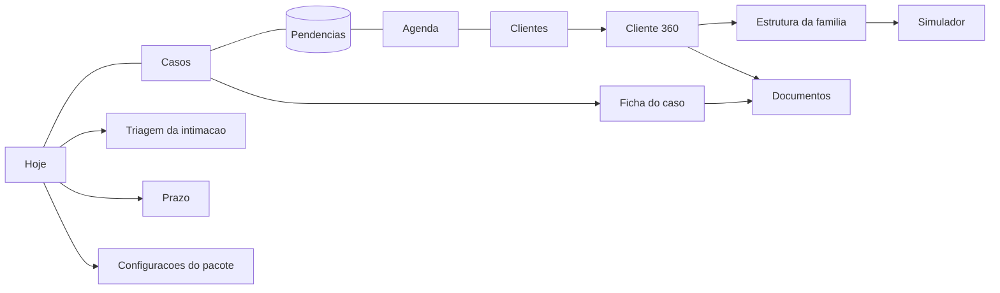

# 101 · Anexo 04 · Interface, telas e copy

> Base: o design system do CICLO como está (`docs/03-DESIGN-SYSTEM.md`, só títulos lidos; tokens em
> `src/app/globals.css`; decisões de identidade em `docs/08-REDESIGN-E-IDENTIDADE.md` II.3: preto quente,
> acento como luz, cor é exceção). O pacote não cria um segundo design system. Protocolo de entrega:
> `C:\Users\Usuario\.claude\code\DESIGN-E-INTERFACE.md` §15 (memória `design-interface-protocolo`).

## 1. Princípios

1. **Duas perguntas por tela**: "o que eu faço agora?" e "o que está parado e com quem?". Tudo que não responde a uma das duas sai.
2. **Densidade alta, ruído zero**: lista antes de cartão; número só ao lado do nome do grupo; sem gráfico sem decisão (regra §16 do LUBI `03`).
3. **Sóbrio**: o público desconfia de "cara de app de salão" e de "cara de IA". Sem emoji, sem brilho, sem `Sparkles`. O ícone do
   Motor (anel) não aparece no pacote: o centro é "Pendências".
4. **Uma ação primária por linha**, as demais num menu de três pontos ou em deslize no celular.
5. **O sistema sugere, a pessoa decide**: toda data de prazo vem com "sugestão a confirmar"; toda mensagem vem com "copiar e enviar".
6. **Nada promete canal**: nenhum texto diz "o cliente vai receber". Diz "mensagem pronta para você enviar".

## 2. Identidade do pacote sem fork

- `#raiz-do-tema` (`layout.tsx:123`) ganha `data-pacote="advocacia"`. Em `globals.css`, um bloco `[data-pacote="advocacia"]`
  redefine só `--acc`, `--acc-soft`, `--on-acc` e `--ring` (acento). Tipografia, espaçamento, superfícies, raios, sombras e os tokens
  de estado (`--ok`, `--warn`, `--bad`, `--risk`, `--info`) ficam os mesmos, nos dois temas.
- Acento **[HIPÓTESE, a medir]**: um verde-petróleo escuro no claro e um verde-sálvia no escuro, com contraste AA sobre `--surface`
  medido pela guarda `contraste.test.ts`. Alternativa: bronze (identidade do LUBI). Decisão visual depois de medir os dois lado a lado.
- Vocabulário: as seis chaves (`vocabulario.ts:19-26`) via `vocab` da profissão; palavras do pacote (caso, prazo, pendência,
  intimação, direção, advocacia, secretaria, estágio) vêm de `PACOTES.advocacia.vocabularioExtra` por um `useVocabularioDoPacote()`.
- Ícones: lucide, traço fino; Casos `Briefcase`, Pendências `ListChecks`, Prazos `CalendarClock`, Intimação `Gavel`? **não** (martelo é
  clichê jurídico): `FileText`. Documentos `FolderLock`.

## 3. Mapa de telas e navegação



Barra de 5 slots (`tabs.ts:17-22`): **Hoje · Casos · [Pendências] · Agenda · Clientes**. No desktop vira coluna (`tab-bar.tsx:44-50`).
Configurações: pelo `Topbar` (NÃO LI), como hoje. Busca: a existente (`CommandPalette`? NÃO LI; se não houver, fica fora do MVP).

## 4. Telas

### 4.1 Hoje

Pergunta: "o que preciso fazer agora?" · quem: toda a equipe · quando: várias vezes ao dia.

```
┌ Hoje · Escritório Alvorada (exemplo)        [Meus ▾] ┐
│ ▲ Captura de intimações parada desde 10:15.          │  ← só direção, só quando há
│   Confira em comunica.pje.jus.br. [Ver detalhes]      │
├─ Atrasado (2) ─────────────────────────────────────── │
│ ● Prazo fatal · Contestação · Família Ventura (ex.)   │
│   passou do fazer até 06/10 · fatal 08/10   [Cumpri] ⋯│
│ ● Documento do cliente trava prazo · Matrícula do     │
│   imóvel · 3 dias de atraso            [Cobrar]  ⋯    │
├─ Hoje (3) ──────────────────────────────────────────── │
│ ● Intimação nova · TJSC · 0000000-00.2026... [Triar]   │
│ ● Reunião 14:00 · Família Ventura · Sala 2  [Briefing] │
│ ● Conferir documento · Contrato social v2  [Conferir] │
├─ Esta semana (4) ──────────────────────────────────── │
│ ...                                                    │
├─ Aguardando cliente (6) · Aguardando terceiros (1) ─── │
└ Tudo em dia? Próximo prazo: 24/10, Inventário (ex.) ──┘
```

- Fonte: `legal_work_queue` ordenada por `prioridade()`; grupos fixos (`prioridade.ts:52-61`).
- Ações por tipo (uma primária): prazo → Cumpri (pede prova se fatal) / Corrigir data (motivo); intimação → Triar; pendência do
  cliente → Cobrar (abre mensagem pronta) / Recebi; documento → Conferir (Aceitar / Devolver com motivo); reunião → Briefing / Realizada.
- Filtro: Meus (padrão para advocacia, secretaria, estágio) · **Exige direção** (padrão para `owner`: fatal atrasado ou de hoje,
  sem responsável, fatal a confirmar, intimação sem triagem após o dia, adiado 3×, aviso do sistema) · Equipe.
- Estados: esqueleto de 6 linhas; vazio "Tudo em dia. Próximo prazo: <data>, <caso>." (sempre com o próximo item; se não há nenhum,
  "Nenhum prazo aberto. Comece por um caso: [+ Caso]"); erro "Não consegui carregar a fila. [Tentar de novo]" + log.
- Não mostra: gráfico, KPI, "atividade recente", nome de parte contrária no título (fica dentro do item).
- Teclado (desktop): `j/k` navega, `Enter` abre, `c` conclui, `a` adia, `/` busca; `aria-keyshortcuts` nos botões.

### 4.2 Clientes

Lista: nome da conta · fase (Em prospecção · Ativo · Encerrado) · responsável · próximo item (texto + data) · selos (sigilo, holding).
Filtro "Meus". Linha de "N clientes restritos" quando há sigilosos fora do alcance. Vazio: "Nenhum cliente ainda. [+ Cliente] ou
[Importar planilha]". Ação secundária: WhatsApp (só se há telefone).

### 4.3 Cliente 360

Topo fixo: nome · fase · responsável · **"Próximo passo: <item> · de <quem> · até <data>"** · [WhatsApp] [+ Novo ▾ (Caso · Pedido · Reunião · Documento · Pessoa · Empresa)].

| Seção | Conteúdo | Ações |
|---|---|---|
| Resumo | pessoas (chips), casos ativos, próximas datas, pendências em aberto (número) | abrir cada um |
| Pendências | `legal_checklist_items` da conta em dois blocos: "Do cliente" e "Do escritório" | Cobrar · Recebi · Conferi · Devolver · Cancelar (motivo) · reordenar |
| Casos | lista com estado, responsável, próximo prazo | abrir; "+ Caso" |
| Pessoas e empresas | pessoas com vínculo e regime; empresas com tipo e status; link "Ver estrutura" | editar; "+ Pessoa"; "+ Empresa" |
| Documentos | por categoria; estado (recebido/aceito/recusado); validade | adicionar; abrir (trilha); pedir (cria pendência) |
| Linha do tempo | `audit_log` filtrado e legível (quem fez o quê) | filtro "só o que o cliente vê" |

Estados: esqueleto por seção; vazio por seção com a ação certa; erro por seção sem derrubar a ficha.

### 4.4 Caso

Topo: título interno · `client_title` (rótulo "o cliente lê:") · estado · responsável · "Próximo passo". Seções: Prazos (com "+ Prazo";
fatal com selo; interno "fazer até") · Pendências do caso · Documentos · Partes e equipe (membros; sigilo) · Estratégia (só direção e
advocacia; aviso "não registre dado de saúde"). Mudar estado abre: "Quer avisar o cliente? Frase que vai na mensagem:" (`client_status_note`),
com botão "Preparar mensagem" (nunca "Enviar").

Sigiloso: faixa "Caso sigiloso: só a equipe do caso vê". Cada abertura grava trilha; a tela diz isso em uma linha discreta.

### 4.5 Estrutura da família

- **Desktop**: grafo (pessoas à esquerda, empresas à direita, arestas com percentual; usufruto tracejado; empresa externa em cinza);
  zoom por roda e botões (+ / − / ajustar); arraste do canvas; clique no nó abre painel lateral com participação efetiva.
- **Celular e leitor de tela**: a mesma informação em **lista indentada** ("Holding Ventura Ltda. (exemplo): Antônio 60%, Helena 40%;
  Holding → Operacional 100%") com `<ul>` aninhado e `aria-label`; alternância "Grafo | Lista" sempre visível; o grafo tem `role="img"`
  com descrição gerada da lista.
- **Participação efetiva**: tabela por pessoa (direta · indireta · total), calculada por `effectiveOwnership` (pura); a conta aparece
  ao tocar ("60% × 100% = 60%").
- **Inconsistências**: soma ≠ 100% por empresa, ciclo, percentual inválido (`validateOwnership`), com selo vermelho no nó e linha
  na lista; nunca corrige sozinho.
- **Linha do tempo societária**: slider de data ("como era em 01/2024") lendo `valid_from/valid_to`.
- **Simulador "e se"**: painel que move X% de um sócio a outro numa empresa e mostra antes × depois; não grava; rodapé fixo:
  "Simulação sem efeito jurídico ou tributário. Revisão da advocacia necessária." (`precisa_revisao`).
- 390 px: lista por padrão, grafo opcional em tela cheia com gesto de pinça; mínimo 48 px em todo controle.
- Custo: biblioteca de layout só se medir < 40 KB gzip; senão SVG próprio com layout por camadas (pessoas | holdings | operacionais).

### 4.6 Pendências (centro)

Fila só de pendências do cliente, agrupada por conta ("Família Ventura (exemplo) · 3 pendências"), com o estado em cor de estado
(`--warn` vencendo, `--bad` vencida, `--ok` recebida). Ação primária por grupo: **Cobrar** (abre a mensagem pronta com um item ou
todos). Por item: Recebi · Conferi · Devolver. Topo: "o que falta de cada cliente, e há quantos dias". Vazio: "Nenhuma pendência
aberta. Quando um caso nasce de um modelo, as pendências aparecem aqui."

### 4.7 Triagem da intimação e confirmação do prazo

```
Intimação · TJSC · Vara X (exemplo) · disponibilizada qui 02/10
Processo 0000000-00.2026.8.24.0000 · [Abrir no DJEN]
Caso: Família Ventura · Inventário (vinculado pelo número)   [Trocar]
─ Texto (abre com trilha) ────────────────────────────────── [Ver texto]
─ Prazo ───────────────────────────────────────────────────
Leitura: "no prazo de 15 (quinze) dias"  → 15 dias
Memória: disponibilizado qui 02/10 → publicado sex 03/10 →
início seg 06/10 → 15 dias úteis (cível) → sex 24/10.
Pulados: 12/10 (feriado nacional). Regras prazo-regras-v1.
[ Data a confirmar:  __/__/____ ]  ← vazia se regra não confirmada
Prazo interno (fazer até): 2 dias úteis antes.
[Confirmar prazo]  [Corrigir com motivo]  [Não gera prazo]  [Descartar]
```

- Quando a regra do rito não está confirmada pela direção: a memória aparece inteira e o campo de data **vem vazio**, com a frase
  "Regra de contagem ainda não confirmada pela direção: digite a data."
- "Leitura incerta" (mais de um prazo, horas, por extenso divergente): "Não consegui ler o prazo com segurança. Quantos dias?"
- Tudo o que cria prazo passa por `POST v1/legal/intimations/[id]/decide`.

### 4.8 Configurações do pacote

OAB da equipe (com aviso permanente "2 pessoas da advocacia sem OAB: as intimações delas não são capturadas") · Regras de contagem
(lista com fonte e caixa "confirmo", só direção; aviso de que a confirmação é responsabilidade do escritório) · Dias antes do
fatal (N) · Feriados da comarca (data, nome, fonte, quem conferiu) · Modelos de checklist do escritório · Segundo fator obrigatório
(ligado; só se desliga com segundo fator ativo) · Nomes a monitorar no DJEN.

## 5. Estados obrigatórios (toda tela)

| Estado | Regra |
|---|---|
| Carregando | esqueleto com a forma da lista; nunca tela branca (`telas-do-admin-tem-loading`) |
| Vazio | diz o próximo passo com botão (`estado-vazio-tem-saida`); em Hoje, sempre o próximo item |
| Erro | diz o que fazer e tem saída (`boundary-de-erro-tem-saida`, `erro-do-cliente-tem-saida`); loga |
| Offline | leitura normal; escrita jurídica desabilitada com "Sem conexão: não dá para gravar prazo agora" (`botao-travado-diz-por-que`) |
| Conflito | `row_version` divergente → "Alguém alterou isto. [Ver diferença] [Recarregar]" sem perder o digitado |
| Sessão expirada | formulário guarda o rascunho local e volta depois do login (`formulario-nao-apaga-o-que-foi-digitado`) |
| Restrito | "1 item restrito" em contagem; nunca o título |

## 6. As 40 frases principais (sem travessão, sem gênero presumido)

Títulos e menu
1. Hoje
2. Casos
3. Pendências
4. Agenda
5. Clientes
6. Estrutura da família
7. Configurações do escritório

Hoje
8. O que precisa de você agora, na ordem em que deve ser feito.
9. Tudo em dia. Próximo prazo: {data}, {caso}.
10. Não consegui carregar a fila. Tentar de novo.
11. Captura de intimações parada desde {hora}. Confira em comunica.pje.jus.br.
12. Exige direção
13. Prazo fatal
14. Fazer até {data} · fatal {data}
15. Intimação nova para triar

Prazos
16. Sugestão a confirmar
17. Regra de contagem ainda não confirmada pela direção: digite a data.
18. Não consegui ler o prazo com segurança. Quantos dias?
19. Prazo fatal não pode ser adiado. Para mudar a data, informe o motivo.
20. Para registrar como cumprido, anexe o protocolo ou escreva a nota.
21. Confirmar prazo
22. Corrigir com motivo

Pendências e documentos
23. O que falta de cada cliente, e há quantos dias.
24. Mensagem pronta para você enviar. Nada é enviado sozinho.
25. Copiar e abrir no WhatsApp
26. Recebi
27. Conferi
28. Devolver com motivo
29. Documento recebido. Aguardando conferência.
30. Este arquivo não pôde ser aceito: tipo não permitido.
31. Pedir documento

Casos e sigilo
32. O cliente lê: {frase}
33. Caso sigiloso: só a equipe do caso vê.
34. 1 item restrito
35. Não registre dado de saúde neste campo.

Estrutura
36. Participação efetiva
37. A soma das participações desta empresa passa de 100%.
38. Simulação sem efeito jurídico ou tributário. Revisão da advocacia necessária.

Segurança e demo
39. Este escritório exige segundo fator. Ative para continuar.
40. Dados fictícios de demonstração. Nenhuma pessoa, empresa ou processo aqui existe.

Proibidas: "especialista", "garantimos", "o sistema calculou", "o cliente vai receber", "Dr./Dra." como prefixo automático,
"Sócio", "Advogado(a)" como rótulo de papel (usar Direção / Advocacia / Secretaria / Estágio / Financeiro), qualquer promessa
de resultado, qualquer número de ganho sem premissa visível.

## 7. Acessibilidade e toque

- Alvos ≥ 48 px (`alvo-de-toque-tem-48`, `-tem-largura`); nunca `toque-48` em dois links na mesma linha de texto (`CLAUDE.md`).
- Foco visível (`foco-visivel-nao-e-apagado`); ordem de foco segue a leitura.
- Região `aria-live="polite"` que **vive sempre no DOM** para filtro de Hoje, troca de dia e resultado de busca (regra do `CLAUDE.md`).
- Contraste AA no claro e no escuro (`contraste.test.ts`).
- `prefers-reduced-motion`: sem transição de tela, sem animação do grafo.
- Grafo com alternativa em lista (§4.5).

## 8. Movimento e desempenho

- Só as transições já existentes (`TransicaoDeTela`, `--dur-1`, `--ease-ios`). Nenhuma animação nova no MVP além do estado de
  carregamento do grafo.
- Teto de JS por rota **[HIPÓTESE]**: Hoje ≤ 180 KB gzip; Estrutura ≤ 240 KB (se a biblioteca passar, SVG próprio). Medido no
  build e comparado com a rota equivalente de beleza, não com um número absoluto solto.
- Tempo até o primeiro conteúdo de Hoje medido em 3G rápido emulado, comparado com `/admin/hoje` de beleza no mesmo momento.

## 9. Plano de verificação visual

Varredura de 8 telas × 3 larguras (390, 768, 1280) × 2 temas, com: rolagem horizontal zero; `elementFromPoint` em cada alvo da
barra e das ações primárias; contraste de texto de estado; estados vazio/erro forçados por `?estado=vazio|erro` só em modo demo;
leitura de tela (NVDA ou VoiceOver) em Hoje e Estrutura. Resultado em `docs/evidencias/advocacia-varredura-<data>.md` com prints.
Nada é "verificado" por leitura de código (memória `auditoria-medir-nao-estimar`).
